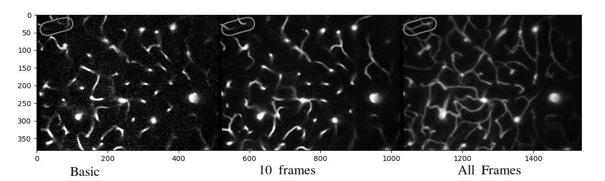
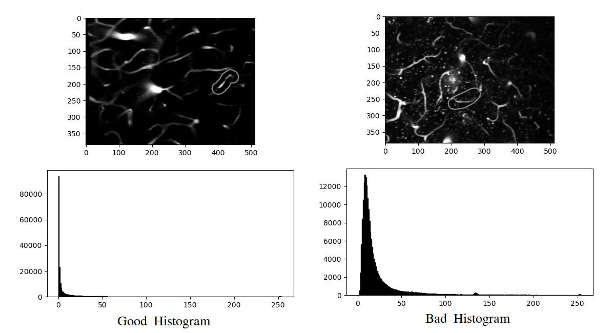
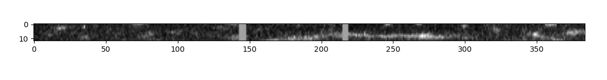

## Workflow

1. Managed to run code provided by partho, code runs on google colab, but does not run on kaggle website.

2. Tried image averaging with 10 frames. When averaged over 10 frames, the output image is fairly noise free and gives an overview of the events of those 10 frames.

3. Averaging all frames of the entire clip results in an overall map of blood vessels present in the video file, but there is some loss of important detail. Noise performance is fairly good

4. Noise condition of the images seem to be apparent from the histogram of the frames. In general, images with more noise have a wider histogram, and good images have a narrower histogram. Histogram operations have been tried, but the results are not good. Histogram equalization gave noisier images. Some sort of histogram squeezing has to be done to obtain better lit images

5. Replaced the binary images from partho's training set with averaged grayscale images and trained model. The results are quite poor
	
- We could try making a 3D map of the blood vessels in the video then use those 3d maps through some 3D convolutional network

- We could sample blood vessels from non ROI locations, and use the samples to train a generative adversarial network. The GAN network will predict how a blood vessel should look like. Say for example, we take blood vessels, and remove some regions from the images - representing blocks. Then we show the edited image,  and teach the network that output should look like the original image when it sees the edited image. The network should be able to learn how to fill the gaps in an image - namely filling up empty spaces. Then when testing with original ROIs, we can ask the network how much the input differs from the predicted image. Larger difference indicates higher chance of block

- Partho suggested that we could build an autoencoder that will do necessary noise removal and brightness correction in any input image. Then the corrected image will be used to train the final stall catching network. For training the autoencoder, we have to manually provide required hyperparameters for each video file that transforms the original video and does the corrections/transformations. Then we have to train the autoencoder on those hyperparameters. This suggestion seems like a reasonable approach. 

6. Did some investigating with pixel intensity values. From the plots of a single row, column or a column taken in direction of depth, the presence of vessels can be observed from concurrent high pixel values. I have an idea for filtering the images with a low pass filter in any one of the three directions.

7. When a 3d array is viewed from the side, the vessels can be seen too, and it can give a rough estimation of depth diffence between consecutive frames.

8. Low pass Butterworth filter does not give good results, simple Gaussian Blur would perform better apparently. Will look into 3D filtering techniques.

9.
http://www.open3d.org/docs/release/getting_started.html
https://docs.scipy.org/doc/scipy/reference/ndimage.html
https://docs.scipy.org/doc/scipy/reference/generated/scipy.ndimage.gaussian_filter.html#scipy.ndimage.gaussian_filter
https://docs.scipy.org/doc/scipy/reference/generated/scipy.ndimage.generic_filter.html#scipy.ndimage.generic_filter